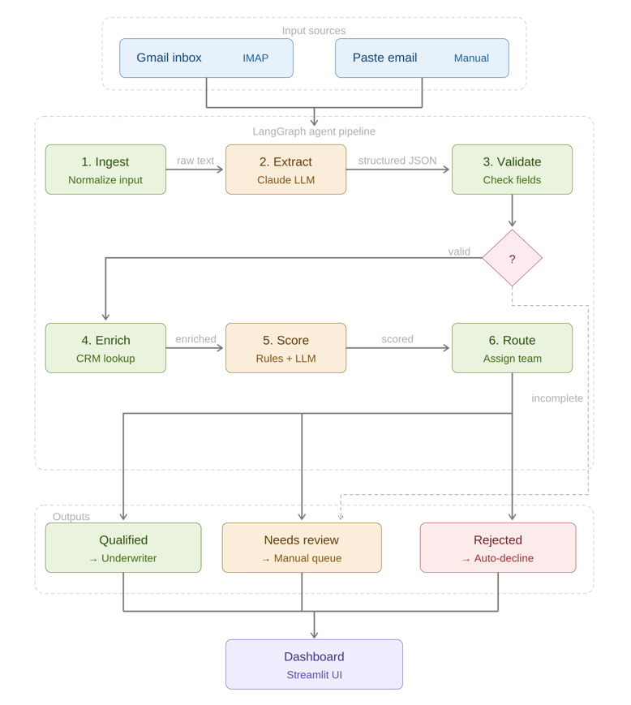

# Fundwell AI Loan Triage Agent
# https://deeputhale-fundwell-assesment-app-ow92qf.streamlit.app/
 
An intelligent loan application triage system that automatically ingests, extracts, validates, enriches, scores, and routes loan applications from email to actionable decisions -- powered by Claude LLM and orchestrated with LangGraph.
 

 
## Overview
 
Fundwell AI Loan Triage Agent automates the front-end of loan processing by transforming unstructured email applications into structured, scored, and routed decisions. The system replaces manual email sorting and data entry with an end-to-end AI pipeline that delivers results to a loan officer dashboard in seconds.
 
### Key Features
 
- **Email ingestion** -- Connects to Gmail via IMAP or accepts manually pasted email content
- **LLM-powered extraction** -- Uses Claude to parse unstructured emails into structured JSON with per-field confidence scores
- **Schema validation** -- Pydantic-based validation ensures data completeness before downstream processing
- **CRM enrichment** -- Enriches applications with existing customer data from CRM lookup
- **Hybrid scoring** -- Combines rule-based checks with LLM scoring for nuanced loan viability assessment
- **Intelligent routing** -- Automatically routes applications to Qualified, Needs Review, or Rejected outcomes
- **Real-time dashboard** -- Streamlit UI for loan officers to monitor and manage the pipeline
## Architecture
 
The system follows a 6-step pipeline orchestrated by LangGraph:
 
| Step | Name | Method | Description |
|------|------|--------|-------------|
| 1 | **Ingest** | Normalize input | Fetch from Gmail (IMAP) or accept pasted email text |
| 2 | **Extract** | Claude LLM | Extract structured fields from raw email text |
| 3 | **Validate** | Pydantic | Validate extracted fields against schema; branch if incomplete |
| 4 | **Enrich** | CRM lookup | Enrich application with existing customer data |
| 5 | **Score** | Rules + LLM | Apply rule-based and LLM scoring to determine loan viability |
| 6 | **Route** | Assign team | Route to final outcome based on score and completeness |
 
### Output Routing
 
| Outcome | Action | Description |
|---------|--------|-------------|
| **Qualified** | Forward to Underwriter | Application meets all criteria; sent for final approval |
| **Needs Review** | Send to Manual Queue | Incomplete or ambiguous data; requires human review |
| **Rejected** | Auto-decline | Application does not meet minimum criteria |
 
## Tech Stack
 
| Component | Technology |
|-----------|------------|
| Orchestration | [LangGraph](https://github.com/langchain-ai/langgraph) |
| LLM | [Claude Sonnet](https://www.anthropic.com/) |
| Schema Validation | [Pydantic](https://docs.pydantic.dev/) |
| UI / Dashboard | [Streamlit](https://streamlit.io/) |
| Email Fetch | IMAP (Gmail App Password) |
 
## Getting Started
 
### Prerequisites
 
- Python 3.10+
- Anthropic API key
- Gmail account with App Password enabled (for email ingestion)
### Installation
 
```bash
git clone https://github.com/DeepUthale/fundwell-loan-triage.git
cd fundwell-loan-triage
pip install -r requirements.txt
```
 
### Environment Variables
 
Create a `.env` file in the project root:
 
```env
ANTHROPIC_API_KEY=your_api_key
GMAIL_ADDRESS=your_email@gmail.com
GMAIL_APP_PASSWORD=your_app_password
CRM_API_URL=your_crm_endpoint
```
 
### Running the Application
 
```bash
# Start the Streamlit dashboard
streamlit run app.py
```
 
The dashboard will be available at `http://localhost:8501`.
 
## Project Structure
 
```
fundwell-loan-triage/
├── app.py                  # Streamlit dashboard entry point
├── pipeline/
│   ├── graph.py            # LangGraph pipeline definition
│   ├── nodes/
│   │   ├── ingest.py       # Email ingestion and normalization
│   │   ├── extract.py      # Claude LLM extraction
│   │   ├── validate.py     # Pydantic schema validation
│   │   ├── enrich.py       # CRM data enrichment
│   │   ├── score.py        # Rule-based + LLM scoring
│   │   └── route.py        # Outcome routing logic
│   └── schemas.py          # Pydantic models for loan data
├── utils/
│   ├── email_client.py     # IMAP email fetching
│   └── crm_client.py       # CRM API integration
├── assets/
│   └── system_architecture.png
├── requirements.txt
├── .env.example
└── README.md
```
 
## Design Decisions
 
- **Single LLM call for extraction** -- Keeps latency low and cost predictable per application
- **Rule-based routing (not LLM-generated)** -- Ensures deterministic, auditable routing decisions
- **Per-field confidence scores** -- Pydantic schema includes confidence and source-span evidence for every extracted field
- **Validation branching** -- Incomplete applications skip enrichment/scoring and route directly to manual review
## Risk Considerations
 
- **Prompt injection** -- Input sanitization before LLM extraction to prevent adversarial manipulation
- **Hallucinated financials** -- Confidence thresholds flag uncertain extractions for human review
- **Silent bias** -- Evaluation pipeline includes fairness metrics across demographic segments
- **Duplicates** -- Deduplication logic prevents the same application from being processed twice
## Evaluation
 
The system is evaluated using a golden dataset with field-level F1 scores, false-advance rate tracking.
